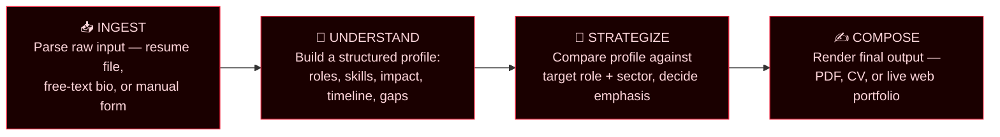
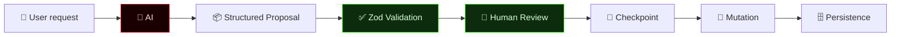
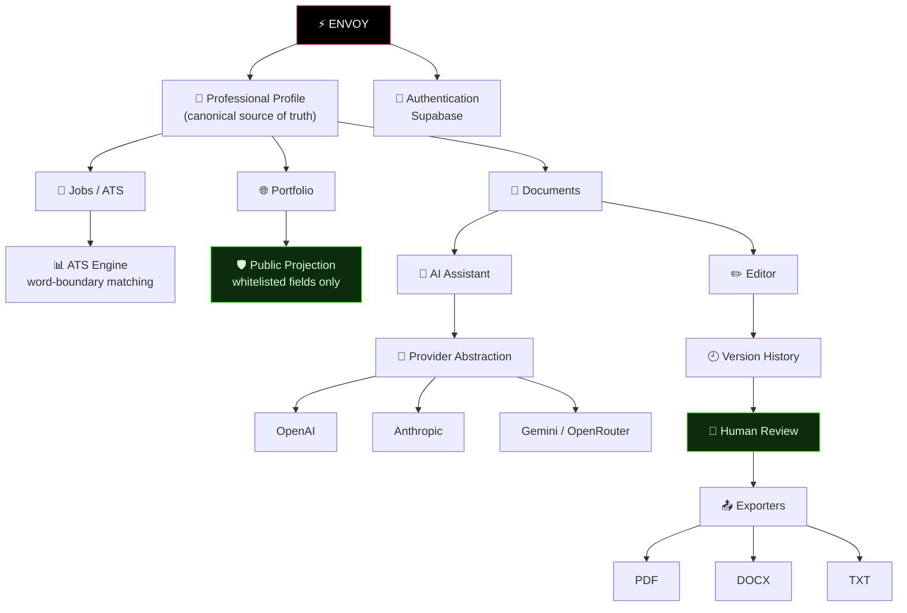
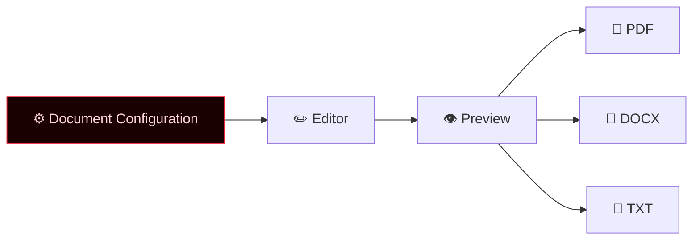
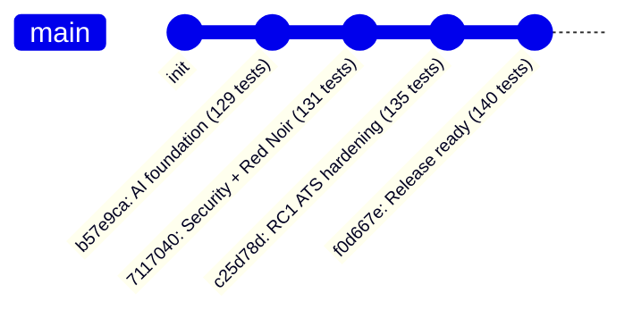
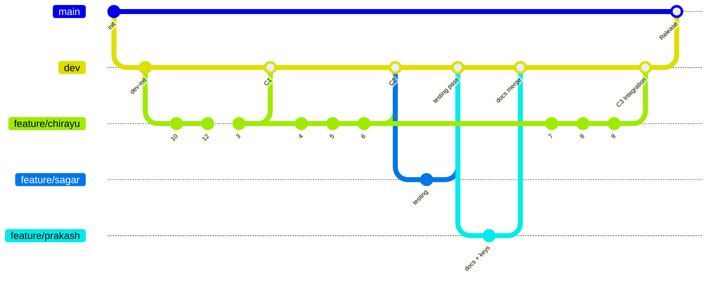

<div align="center">


<br/>

[](https://github.com/Crusty-chirayu/Envoy/blob/main/LICENSE)
[](https://github.com/Crusty-chirayu/Envoy/blob/main/CONTRIBUTING.md)
[](#-final-verification-state)
[](#-final-verification-state)
[](#-why-envoy-exists)
[](#-the-red-noir-design-system)

**[Why](#-why-envoy-exists) · [What It Does](#-what-envoy-actually-does) · [How It Thinks](#-how-envoy-thinks) · [Architecture](#️-system-architecture) · [Security](#-security-engineering) · [Engineering Milestones](#-engineering-milestones) · [Quick Start](#️-quick-start) · [Roadmap](#️-roadmap) · [Team](#-the-builders)**


</div>

<br/>

> [!IMPORTANT]
> **This README reflects Envoy's current, verified engineering state** — not the launch-day scaffolding. Every checkpoint, test count, and security boundary below is drawn directly from the project's own release verification, tracked in [Engineering Milestones](#-engineering-milestones). Nothing here is aspirational unless it's explicitly under [Roadmap](#️-roadmap).

<br/>

## 🧭 Why Envoy Exists

Every serious job seeker hits the same wall, over and over:

- Rewrite the same resume for the fortieth time because a new role needs different keywords.
- Have zero idea what an ATS is actually scoring you on.
- Watch every genuinely good resume tool sit behind a $12/month paywall.
- End up with a portfolio site that looks like a 2014 template because building one from scratch takes a weekend you don't have.

None of that is a *skill* problem. It's a *tooling* problem. Envoy exists to close it — permanently, and for free.

> **Envoy is not a form that spits out a PDF.** It's an agent that reads your background the way a sharp recruiter would, cross-references it against the role and sector you're chasing, and writes the version of your story that gets past the filter and into a human's hands — with you approving every change it proposes.

<br/>

## 🎯 What Envoy Actually Does

| Stage | What happens |
|---|---|
| 🧠 **Understand** | Parses your raw background or an existing resume (PDF/DOCX) into a structured profile — skills, roles, impact, gaps and all |
| 🎯 **Target** | Cross-references that profile against the job description, sector norms, and keyword signal to figure out what actually needs to be said |
| ✍️ **Deliver** | Renders the result into an ATS-ready resume, an academic CV, or a live, deployable portfolio — your choice, your template |

**Feature-by-feature:**

- 🤖 **Autonomous Career Agent** — doesn't just fill a template, it *decides* what to keep, cut, reframe, or quantify based on the target role, then proposes the change rather than silently applying it.
- 📄 **Legacy Resume Enhancer** — upload what you already have; Envoy previews the extracted data and waits for your confirmation before anything touches your Master Profile.
- 🎯 **Word-Boundary ATS Intelligence** — deterministic, explainable keyword matching. `Java` doesn't false-positive on `JavaScript`; `C` doesn't false-positive on `CSS`. Plural/singular handling and deduplication included.
- 🎨 **Open Template Library** — every template is free, versioned, and community-extendable. No "Pro" tier hiding the good fonts.
- 🌐 **Portfolio Publishing** — your structured profile becomes a public site through a dedicated, whitelisted projection — private by default until you explicitly publish.
- 🔓 **Radically Free** — this isn't a freemium funnel. Envoy ships fully open-source, every feature, forever.

<br/>

## 🔮 How Envoy Thinks

Envoy's core is a four-stage agentic loop — not a single prompt-and-pray call, but a pipeline where each stage checks and enriches the one before it.



Each stage hands a structured artifact to the next — never raw text — so nothing gets lost in translation and every output stays traceable back to real input.

But the loop doesn't end at COMPOSE. Every AI-proposed change runs through a stricter internal gate before it ever reaches your data:



**AI output is data, not authority.** That single sentence is Envoy's most important design decision — see [Security Engineering](#-security-engineering) for exactly how it's enforced.

<br/>

## 🏗️ System Architecture



### 📂 Project Structure

```
envoy/
├── .github/                 # CI/CD workflows, issue & PR templates
├── apps/
│   ├── agent/                # LLM prompts, agent orchestration, optimization logic
│   ├── parser/                # PDF/DOCX/OCR extraction → structured JSON
│   └── web/                    # Dashboard, template studio, portfolio host
├── packages/
│   ├── templates/              # Open-source LaTeX / HTML / Markdown templates
│   └── ui/                      # Shared component library across apps
├── docs/                     # Architecture decision records, setup guides
├── .gitignore
├── CONTRIBUTING.md
├── LICENSE
└── README.md
```

<br/>

## 🎨 The Red Noir Design System

Envoy's UI was deliberately rebuilt to stop looking like "a basic AI-generated SaaS dashboard." The result is **Red Noir**:

| Element | Choice |
|---|---|
| **Primary accent** | Crimson `#ef233c` |
| **Surfaces** | Deep black/red backgrounds, subtle gradients, starfield textures |
| **Typography** | Manrope + Inter |
| **Interaction detail** | Custom selection styling, red focus states, controlled glow — never overdone |
| **Signature CTA** | `shiny-cta` — conic-gradient border, subtle rotation, red glow on hover |

Redesigned end-to-end under this system: the **landing page** (hero, live pipeline/status badge, bento feature grid, integration ticker, four-stage workflow visual, large-typography footer), **auth surfaces** (`/login`, `/signup`, `/reset` — dark cards, red glow, stronger focus states), and the **dashboard** (profile-completeness ring, status badges, quick document creator, portfolio controls) — one consistent visual language, not three different apps stitched together.

<br/>

## 🛡️ Security Engineering

After the foundational systems were stable, Envoy went through a dedicated security audit built around one principle:

> **Never trust the browser, an imported document, a job description, or an AI model merely because it's part of the user's own workflow. Everything crossing a trust boundary gets validated.**

<table>
<tr><td width="6%"><b>S1</b></td><td width="94%">

**Public Portfolio Projection.** Public portfolio rendering never touches the raw profile record. A dedicated server-side projection (`src/lib/portfolio/public-projection.ts`, served via `/api/p/[slug]`) whitelists only fields meant for publication — name, headline, public contact info, experience, education, skills, projects — and structurally excludes private fields, internal metadata, database IDs, and unrelated records.

</td></tr>
<tr><td><b>S3</b></td><td>

**AI Proposal Validation Gate.** The AI cannot generate arbitrary mutations against your profile or documents. Every proposal is checked against a strict `ProposalBlockSchema` (Zod) before a human ever sees it, which blocks arbitrary computed-key overwrites — the kind of thing a prompt-injection attempt would try to exploit. AI output is data, not authority.

</td></tr>
<tr><td><b>S4 / S5</b></td><td>

**AI Transport Resilience.** Streaming responses are parsed with a standardized byte-buffered SSE parser (`createSSEParser`) instead of assuming one network packet equals one logical event — a single SSE line can legitimately span multiple TCP packets, and naive parsing breaks on exactly that. Provider calls are wrapped in `fetchWithTimeout` and `fetchWithResilience`, adding connection-phase timeouts, retries, and jittered backoff so the app isn't hostage to one provider's bad day.

</td></tr>
<tr><td><b>S6</b></td><td>

**Open Redirect Protection.** Authentication redirect parameters (e.g. on `/login`) are sanitized through `sanitizeRedirectPath` before use, closing off a classic open-redirect vector.

</td></tr>
<tr><td><b>S7</b></td><td>

**Privacy by Default.** New portfolios are created **private**. Publishing is an explicit user action — never an accidental default.

</td></tr>
</table>

<sub>The audit's designated range was S1–S9; the boundaries above are the ones with confirmed, described fixes. If S2/S8/S9 map to shipped changes not detailed here, add them alongside these rather than leaving the numbering implying gaps.</sub>

<br/>

## 📤 Export & Document Fidelity

The non-negotiable rule: **Editor = Preview = Export.** What you see while writing is exactly what comes out the other end.



- All **13 canonical section types** are supported end-to-end (Summary, Experience, Education, Skills, Projects, Certifications, Achievements, Publications, Awards, Volunteering, Languages, Interests, Custom) — no section the editor supports gets silently dropped by an exporter.
- Section **visibility and ordering** are respected identically across DOCX and TXT output, not just PDF.
- A specific formatting bug (optional education fields rendering as a literal `in undefined`) was fixed so missing optional fields are omitted cleanly instead of leaking placeholder text into a real document someone sends to an employer.

<br/>

## 📥 Safe Import Workflow

Uploading a resume used to risk silently overwriting curated profile data. That's not acceptable for information people have spent years refining, so the flow now always stops for a human:


The **Import Preview Modal** shows identity, summary, experience, education, skills, and projects exactly as extracted — before any of it touches your Master Profile. Automated extraction stays human-controlled, always.

<br/>

## 🧬 Engineering Milestones

<details>
<summary><b>🔹 <code>b57e9ca</code> — AI Workflow Foundation</b> (129/129 tests)</summary>
<br/>

- Added contextual AI conversation/history — the assistant stopped behaving like an isolated generic chatbot
- Added deterministic document-section navigation and active-section awareness, tying the AI tighter to the actual editor state
- Hardened OpenRouter configuration to be server-side only, not exposed to the client
- Verified `.env.local` is properly git-ignored
- **Verification:** TypeScript ✅ · Lint ✅ · Build ✅ · 129/129 tests ✅ · pushed to `origin/main`

</details>

<details>
<summary><b>🔹 <code>7117040</code> — Security, Export & Red Noir Redesign</b> (131/131 tests)</summary>
<br/>

- Shipped the S1 server-side public portfolio projection
- Shipped the S3 AI proposal Zod validation gate
- Added resilient byte-buffered SSE parsing (S4/S5) and provider timeout/retry/backoff
- Added open-redirect protection on auth flows (S6)
- Changed portfolio visibility default to private (S7)
- Synchronized DOCX/TXT exporters with the editor's section config; added full 13-section support
- Shipped the Red Noir visual system and redesigned landing, auth, and dashboard surfaces
- **Verification:** TypeScript ✅ · 131/131 tests ✅ · Production build ✅ · pushed to `origin/main`

</details>

<details>
<summary><b>🔹 <code>c25d78d</code> — RC1: ATS & Import Hardening</b> (135/135 tests)</summary>
<br/>

- Upgraded ATS keyword matching to regex word-boundary matching — `Java` no longer false-positives on `JavaScript`, `C` no longer false-positives on `CSS`
- Added plural/singular handling and keyword deduplication to the ATS analyzer
- Added a dedicated ATS test suite (`src/lib/ats/analyzer.test.ts`) covering boundaries, plurals, dedup, and composite scoring
- Shipped the Import Preview Modal and mandatory user confirmation before any profile mutation from an import
- **Verification:** TypeScript ✅ · 135/135 tests ✅ (9 test files) · Production build ✅ · `main` synced, working tree clean

</details>

<details>
<summary><b>🔹 <code>f0d667e</code> — Final Productization (Release Ready)</b> (140/140 tests)</summary>
<br/>

- Shifted explicitly to adversarial QA — "break the product before users do" — covering real workflows, failure paths, responsiveness, and accessibility
- Strengthened rollback/version-recovery safety across AI edits, imports, and manual changes
- Further exporter fidelity work, keeping Editor = Preview = Export true under edge cases
- Expanded the regression suite to its final count
- **Verification:** TypeScript 0 errors ✅ · **140/140 tests passing** (10 test files) ✅ · Production build (Next.js 15) ✅ · synced to `origin/main`, superseding `c25d78d`

</details>



<br/>

## ✅ Final Verification State

<div align="center">

```
┌─────────────────────────────────────┐
│          ENVOY RELEASE READY        │
├─────────────────────────────────────┤
│ Branch:       main                  │
│ Commit:       f0d667e               │
│ Remote:       origin/main           │
│                                     │
│ TypeScript:   0 errors              │
│ Tests:        140 / 140 PASS        │
│ Suites:       10                    │
│ Build:        PASS                  │
│ Git:          SYNCED                │
└─────────────────────────────────────┘
```

</div>

<br/>

## 📐 The Principles Behind It

| Principle | What it means in practice |
|---|---|
| **Canonical data** | The professional profile is the single source of truth — everything else is a view or derivation of it |
| **Human-controlled AI** | AI proposes changes; users approve them. Full stop. |
| **Structured AI** | AI output is validated (Zod) before it's trusted, never blindly applied |
| **Security at boundaries** | Public data, imported data, AI output, and user requests are all treated as potentially untrusted |
| **Deterministic ATS** | Scoring is explainable and reproducible, not "mysterious AI magic" |
| **Provider abstraction** | AI providers (OpenAI, Anthropic, Gemini, OpenRouter) are interchangeable behind one interface |
| **Export fidelity** | The editor's configuration drives every export format, identically |
| **Version safety** | Major modifications can always be rolled back |
| **Privacy by default** | Publishing a portfolio requires an explicit action, never an accident |
| **Public projection** | Public data is deliberately projected, never the raw private record |
| **Local/cloud architecture** | The product works in demo/local mode and with full Supabase cloud persistence |
| **Test-driven hardening** | Tests get added around real engineering risk, not to inflate a counter |

<br/>

## ✨ Full Feature Set

<table>
<tr>
<td width="50%" valign="top">

**Professional Profile**
- Canonical professional profile
- Structured experience, education, skills, projects
- Certifications, achievements, publications, awards
- Volunteering, languages, interests, custom sections

**Resume / CV Builder**
- Multiple document types & templates
- A4 document canvas, live editing
- Section visibility & ordering
- Version history with rollback

**AI Career Assistant**
- Contextual, document-aware conversation
- Structured proposals + diffs, human approval required
- Multi-provider abstraction with streaming, timeout/retry

</td>
<td width="50%" valign="top">

**ATS Intelligence**
- Job description analysis & job targeting
- Word-boundary keyword matching, plural/singular handling
- Deduplication, composite explainable scoring

**Resume Import**
- PDF / DOCX ingestion → structured extraction
- Import preview + human confirmation
- Checkpoint-protected application to profile

**Export**
- PDF, DOCX, TXT — full section fidelity

**Portfolio & Platform**
- Public portfolio, private by default, public projection
- Slug handling, SEO/OpenGraph support
- Supabase auth + cloud persistence, or local/demo mode

</td>
</tr>
</table>

<br/>

## 🛠️ Quick Start

### Prerequisites
- Node.js `>= 18.x` or Python `>= 3.10`
- Git

### Setup

```bash
# 1. Clone it
git clone https://github.com/Crusty-chirayu/envoy.git
cd envoy

# 2. Install dependencies
npm install               # or: pip install -r requirements.txt

# 3. Configure environment
cp .env.example .env       # add your API keys / config

# 4. Run it
npm run dev
```

<br/>

## 🌿 Branching Strategy & Contribution Flow

The diagram below reflects actual commit share, not headcount — Chirayu drives continuous development on `feature/chirayu`, while Sagar and Prakash contribute focused, single-pass merges (testing, and docs/API key research respectively).



- **`main`** — production-ready, protected, no direct pushes.
- **`dev`** — integration branch; every finished feature lands here before release.
- **`feature/<name>`** — one branch per feature, per person.

```bash
git checkout -b feature/your-feature-name
git commit -m "feat: add resume parser module"
git push origin feature/your-feature-name
# open a PR into dev
```

<br/>

## 🗺️ Roadmap

> Updated against the verified engineering state above — not the original launch scaffolding.

- [x] Repository scaffolding & team workflow
- [x] Document parser (PDF/DOCX → structured JSON)
- [x] Sector & keyword intelligence engine — hardened to word-boundary matching in RC1
- [x] Agentic rewrite/optimization pipeline — Zod-validated proposals + human approval
- [x] Portfolio publishing with private-by-default, whitelisted public projection
- [ ] Open template library — templates exist and are used across exports; exact count/catalog vs. the original "5 resume + 2 CV" target is `TODO` to confirm
- [ ] One-command external deployment — portfolio *publishing* within Envoy is shipped; a separate one-command deploy-elsewhere flow is `TODO` to confirm as distinct from that
- [ ] Public beta

<br/>

## 🤝 Contributing

1. Fork the repo
2. Branch off `dev`: `git checkout -b feature/AmazingFeature`
3. Commit: `git commit -m "feat: add AmazingFeature"`
4. Push: `git push origin feature/AmazingFeature`
5. Open a Pull Request into `dev`

Full guidelines live in [`CONTRIBUTING.md`](https://github.com/Crusty-chirayu/Envoy/blob/main/CONTRIBUTING.md).

<br/>

## 👥 The Builders

| | Name | GitHub | Contribution | Focus |
|---|---|---|---|---|
| 🧠 | **Chirayu** | [@Crusty-chirayu](https://github.com/Crusty-chirayu) | **100%** | Core Architecture, Full Development, Design & *all*|


<br/>

## 📜 License

Distributed under the **MIT License**. See [`LICENSE`](https://github.com/Crusty-chirayu/Envoy/blob/main/LICENSE) — free to use, modify, and distribute, no strings attached.

**Built because career tools that actually work shouldn't cost a subscription.**

<div align="center">

⭐ **Star this repo** if you want to watch Envoy keep going from a release-ready core to public beta.


</div>
